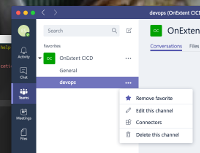

----------

## NOTICE - help wanted
MSFT is ending support of the connector protocol and this module will need to be migrated to the new Teams Workflow method https://devblogs.microsoft.com/microsoft365dev/retirement-of-office-365-connectors-within-microsoft-teams/

-----------

# Concourse CI Teams Resource

Sends messages to [Microsoft Teams](https://teams.microsoft.com) from
within [Concourse CI](https://concourse-ci.org/) pipelines.

Implements the Microsoft Teams
[Connector](https://dev.outlook.com/Connectors/Reference) protocols and
the Concourse CI [resource](https://concourse-ci.org/implementing-resource-types.html)
protocols.


Resolves at runtime Concourse CI environment variables referenced in your Teams
connector messages such as:

```
$BUILD_ID
$BUILD_NAME
$BUILD_JOB_NAME
$BUILD_PIPELINE_NAME
$BUILD_TEAM_NAME
$ATC_EXTERNAL_URL
```

## STATUS

* Actively used and supported (as of Oct '21)
* Works with all Concourse CI releases from 11/2016 thru at least 10/2021


## SETUP

1. Open the Microsoft Teams UI.
2. Identify the channel you wish to post notifications to - ie: #devops....
3. Open the "more options" menu of that channel and select "Connectors".

4. Select "Incoming Webhook" and respond to the prompts for details like the
icon and connector name.

5. Use the webhook url from above in your pipeline `source` definition.  The
example below creates an `alert` resource.  Each point in the pipeline labeled
`alert` is a Microsoft Teams Connector message.


## PIPELINE EXAMPLE


### Source Configuration

```
resources:

  - name: alert
    type: teams-notification
    source:
      url: https://outlook.office365.com/webhook/blah-blah-blah   [required]
      proxy_url: https://my.corp.net                              [optional]
      proxy_port: 1234                                            [optional]
      proxy_username: myusername                                  [optional]
      proxy_password: mysecret                                    [optional]
      skip_cert_verification                                      [optional]
      verbose                                                     [optional]
      silent                                                      [optional]

```
* `url`: *Required.* The webhook URL as provided by Teams when you add a
connection for "Incomming Webhook". Usually in the
form: `https://outlook.office365.com/webhook/XXX`
* `proxy_url`: *Optional.* Basic auth for forwarding proxies - prefix with protocol. ie: https://
* `proxy_port`: *Optional.* Basic auth for forwarding proxies
* `proxy_username`: *Optional.* Basic auth for forwarding proxies
* `proxy_password`: *Optional.* Basic auth for forwarding proxies
* `skip_cert_verification`: *Optional.* cURL `-k` option for debugging when behind TLS rewrite proxies when the internal cert is self-signed or not properly distributed
* `verbose`: *Optional.* cURL `-v` option for debugging 
* `silent`: *Optional.* cURL `-s` option for no logging 

Next, define the non-built-in type:

```
resource_types:

- name: teams-notification
  type: docker-image
  source:
    repository: navicore/teams-notification-resource
    tag: v0.9.12
```

## Param Configuration

Example of an alert in a pull-request job:
```
- name: Test-Pull-Request
  plan:
  - get: {{mypipeline}}-pull-request
    trigger: true
  - task: test-pr
    file: {{mypipeline}}-pull-request/pipeline/test-pr.yml
    on_success:
      put: alert
      params:
        text: |
          pull request tested: success
        title: {{mypipeline}} Pull Request Tested
        actionName: {{mypipeline}} Pipeline
        actionTarget: $ATC_EXTERNAL_URL/teams/$BUILD_TEAM_NAME/pipelines/$BUILD_PIPELINE_NAME/jobs/$BUILD_JOB_NAME/builds/$BUILD_NAME
    on_failure:
      put: alert
      params:
        color: EA4300
        text: |
          pull request tested: **WITH ERRORS**
        title: {{mypipeline}} Pull Request Tested
        actionName: {{mypipeline}} Pipeline
        actionTarget: $ATC_EXTERNAL_URL/teams/$BUILD_TEAM_NAME/pipelines/$BUILD_PIPELINE_NAME/jobs/$BUILD_JOB_NAME/builds/$BUILD_NAME
```
* One of the following:
  * `text`: *Required.* Text of the message to send - markdown supported (higher precedence over `text_file`)
  * `text_file`: *Required.* A location of text file of the message to send, usually an output from a previous task - markdown supported
* `title`: *Optional.*
* `actionName`: *Optional.* Text on the button/link (shows up as a link though the Teams docs show a button)
* `actionTarget`: *Optional.* URL to connect to the button/link
* `style`: *Optional.* Adaptive Card header style. Can be one of 'good', 'attention', 'warning'. If not provided, `title` and `text` are scanned for keywords to determine the style. If no keywords are found, 'default' is used.
* ~~`color`~~: *Deprecated* 

# MORE EXAMPLES


See `*.yml` files in the  directory.

# DEVELOPMENT ENVIRONMENT

Testing with docker-compose.  

See working standalone docker-compose example in  dir.

# PROXY SUPPORT

Proxy support testing is limited to squid4.  Dev env was created with default squid4 setup.

```
sudo service squid start
sudo vim /etc/squid/squid.conf
sudo service squid restart
sudo service squid stop
```

We tested proxy support with squid4.  We don't have access to a wide range of proxies.

The ntlm flag on cURL is not set in our implementation but squid4 was happy to call our session ntlm.  We're open to PRs for more support of proxies.
